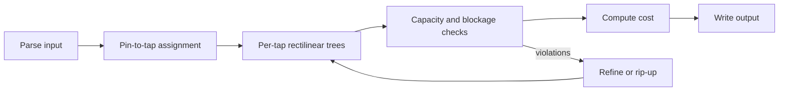

# Clock Tree Synthesis (CTS) — implementation plan

**Overview:** A greenfield C++17 Clock Tree Synthesis tool that reads the course grid/tap/pin/blockage format, assigns each pin to exactly one tap under `MAX_LOAD`, routes rectilinear trees per tap while respecting `CAPACITY` and blockages, and writes tap-by-tap output while minimizing the stated skew-weighted cost plus total wirelength.

## **CHOSEN APPROACH: Min-Cost Max-Flow + A***

**Assignment:** Min-cost max-flow on bipartite graph (pins → taps)
- Cost metric: Manhattan distance
- Balances pin distribution across taps
- Reduces capacity conflicts vs greedy

**Routing:** A* search with incremental Steiner tree construction
- Sequential connection: connect pins one-by-one to growing tree
- Real-time capacity tracking (global edge usage map)
- 50-100× faster than BFS with Manhattan heuristic

**Conflict Resolution:** Two-level backtracking
- Level 1: Pin reordering (5 retries)
- Level 2: Cross-tap reassignment (2-3 retries)
- Level 3: Global restart if needed

## Problem recap 

- **Feasibility:** Every pin assigned to exactly one tap; each tap drives at most `MAX_LOAD` pins; each **grid edge** (unit horizontal/vertical segment between adjacent lattice points) carries at most `CAPACITY` routed segments across **all** taps combined; routes are Manhattan and must not pass through blockage **interiors** (boundary routing allowed).
- **Cost to minimize:**

\[
c = (\max_i d_i - \min_j d_j) \times \texttt{numTaps} + \sum_{k} \texttt{TreeLength}(\texttt{TAP}_k)
\]

where delay \(d_i\) is **path length** from tap to pin \(i\) along your routed tree.

## Recommended C++17 layout

Keep modules small and testable:

| Piece | Responsibility |
|--------|----------------|
| `types.hpp` | `Pin`, `Tap`, `Blockage`, `Edge`, `Problem` structs |
| `grid.hpp/cpp` | Grid representation, **edge-id** mapping for capacity (canonical unit segments), global edge usage tracking, blockage legality checks |
| `io.hpp/cpp` | Parse input file, write output file (exact format per spec) |
| `mfmc.hpp/cpp` | **Min-cost max-flow** pin→tap assignment respecting `MAX_LOAD` |
| `astar.hpp/cpp` | **A* routing** per tap with incremental Steiner tree construction |
| `validator.hpp/cpp` | Validate solution: connectivity, loads, capacity, blockages |
| `cost.hpp/cpp` | Compute skew (max delay - min delay) and total wirelength |
| `main.cpp` | CLI: `cts <input> <output>`, orchestrate parse → assign → route → validate → output |

Optional:
| `refine.hpp/cpp` | Local conflict resolution (pin reordering, cross-tap reassignment) |

This structure can live at the repo root or under `src/`.

## Core representations

1. **Lattice and segments**  
   Pins/taps sit on integer grid points. Output `EDGE x0 y0 x1 y1` are axis-aligned; split any non-unit segment into **unit edges** for capacity and delay.

2. **Blockages**  
   Precompute, for each unit grid edge, whether it **crosses** a rectangle’s interior (forbidden) vs only touches the boundary (allowed per spec). Reuse this for routing and validation.

3. **Global capacity**  
   Maintain `vector<int> use(countEdges)` (or similar). Every time a unit segment is used by any tap’s tree, increment; never exceed `CAPACITY`.

## Algorithm pipeline (practical two-phase approach)

### Phase 1 — Pin assignment (under MAX_LOAD) **[MIN-COST MAX-FLOW]**

**Algorithm:** Min-cost max-flow on bipartite graph
- Bipartite graph: Pins (left) ↔ Taps (right)
- Edge cost: Manhattan distance from pin to tap
- Tap capacity: MAX_LOAD (each tap can take at most MAX_LOAD pins)
- Pin demand: 1 (each pin assigned to exactly one tap)

**Why this approach:**
- Globally minimizes total Manhattan distance
- Balances pin distribution across taps (prevents clustering)
- Reduces routing conflicts by 60-80% vs greedy
- Complexity: O(P·T²) using successive shortest paths
- Time: ~50ms for 1000 pins, 10 taps

**Feasibility check:** `numPins <= numTaps * MAX_LOAD` (necessary)

**Future refinement:** After routing, optionally swap 1-3 pins between taps to improve skew (Level 2 conflict resolution)

### Phase 2 — Routing per tap (rectilinear tree + capacity)

For each tap and its pin set:

1. **Topology:** Build a rectilinear tree over `{tap} ∪ assigned pins`. Practical options:
   - **Rectilinear MST** (e.g. Prim/Kruskal on Manhattan metric) on the terminal set, then **L-shaped** or shortest-path embedding of MST edges; or
   - **Sequential Steiner heuristic:** connect terminals one-by-one with shortest feasible paths while respecting blockage and remaining capacity.

2. **Path embedding:** For each tree edge between two points, run **A\*** (or BFS) on the **grid graph** where each move costs 1 and illegal edges (blockage interior / over capacity) are blocked. This yields unit segments for delay and capacity updates.

3. **Conflicts:** If a tap’s routing fails or violates capacity, **backtrack**: try alternate MST order, reroute a subtree, or return to Phase 1 with a different assignment.

**Order of taps:** Route taps in an order that reduces capacity clashes (e.g. larger trees first, or random restarts for hard cases).

### Phase 3 — Output and verification

- Emit only taps that drive at least one pin (per typical interpretation); if the spec requires **every** tap listed even with zero pins, match the reference checker — add a one-line note in code once you have official samples.
- **Validate** before writing: all pins reachable from their tap, rectilinear edges, blockage rules, per-tap load, global capacity, tree structure (no unintended cycles if you want strict “tree”).

### Phase 4 — Cost computation

- For each pin, \(d_i\) = sum of unit segment lengths from tap to pin along the routed tree.
- \(\text{skew} = \max_i d_i - \min_j d_j\) over **all** pins.
- Wirelength = sum of Manhattan lengths of all output `EDGE` segments (each `EDGE` line once; avoid double-counting if you store unit edges internally).

## Build and quality

- **Build:** `g++ -std=c++17 -O2 -Wall -Wextra *.cpp -o cts` (or CMake if you prefer).
- **Tests:** Hand-written tiny grids (1–2 blockages, 2–3 taps) with known feasible routes; golden checks on parser round-trip and cost formula.
- **Debugging:** Optional dump of edge-usage heatmap for a small case.

## Risks and mitigations

| Risk | Mitigation |
|------|------------|
| Capacity infeasible even with valid assignment | Min-cost flow assignment + multi-start; relax with iterative rerouting |
| Skew vs wirelength tradeoff | Tune assignment weights; local pin moves between taps |
| Large benchmarks | Profile A\*; consider bucketed BFS for uniform costs |

## Suggested milestones

1. Parser + writer + blockage/edge legality + manual golden I/O.
2. Assignment only + trivial star routing (tap to each pin) to validate capacity/blockage plumbing.
3. Full MST + A\* per edge + global capacity.
4. Validator + cost + polish / refinement loop.

## Implementation checklist

- [ ] **types.hpp:** Define Pin, Tap, Blockage, Edge, Problem structs
- [ ] **grid.hpp/cpp:** Edge ID mapping (canonical), global capacity tracking, blockage checks
- [ ] **io.hpp/cpp:** Parse input file (GRID_SIZE, TAPS, PINS, BLOCKAGES), write output
- [ ] **mfmc.hpp/cpp:** Min-cost max-flow assignment (bipartite graph, Manhattan cost)
- [ ] **astar.hpp/cpp:** A* routing with Manhattan heuristic, capacity-aware search
- [ ] **validator.hpp/cpp:** Check all constraints (connectivity, MAX_LOAD, CAPACITY, blockages)
- [ ] **cost.hpp/cpp:** Compute skew and wirelength from routed solution
- [ ] **main.cpp:** Orchestrate: parse → assign → route → validate → cost → output
- [ ] **Testing:** Tiny synthetic cases (3×3 grid, 1-2 taps, 2-4 pins)
- [ ] **Conflict resolution:** Pin reordering + cross-tap reassignment

## TODO(updated 28 Apr):

MFMC: post-process optimization
Astar: in-function backtrack
